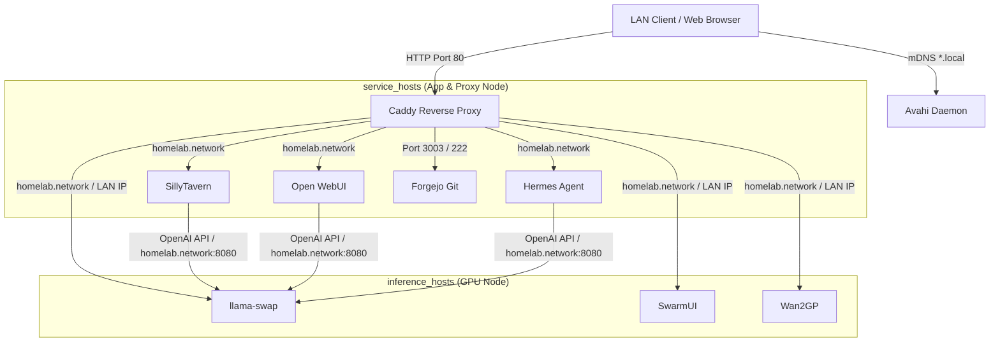

# Architecture & Repository Structure

This document describes the architectural layout, host group design, networking topology, and directory structure of the homelab infrastructure.

---

## Overview

The homelab infrastructure automates self-hosted services using **Ansible** for centralized configuration and **Podman Quadlets** integrated into `systemd` for container management.

Key principles:
- **Rootless Containers**: All application containers run under rootless Podman environments with systemd user linger enabled.
- **Declarative Unit Files**: Services are defined as `.container` Quadlet templates deployed into `~/.config/containers/systemd/`.
- **mDNS Alias Resolution**: LAN clients access services using zero-configuration mDNS hostnames (`*.local`) published via Avahi.
- **Centralized Reverse Proxy**: Caddy listens on unprivileged host port `80` to proxy incoming HTTP requests based on the `Host` header to upstream container ports.

---

## Architecture & Host Groups

The inventory organizes machines into functional host groups:



### Host Group Descriptions

- **`inference_hosts`**:
  - Hosts equipped with GPUs for artificial intelligence and machine learning workloads.
  - Deploys NVIDIA Container Toolkit (CDI generation) and Quadlet services such as `llama-swap`, `SwarmUI`, and `Wan2GP`.
  - `llama-swap` serves as the single, unified multi-model proxy and VRAM lifecycle manager for all LLM inference traffic.
- **`service_hosts`**:
  - Hosts running application containers, proxy services, and local network utilities.
  - Deploys `caddy`, `sillytavern`, `open-webui`, `hermes-agent`, `forgejo`, and `avahi`.
  - Frontend AI applications (`sillytavern`, `open-webui`, `hermes-agent`) route model completion calls internally to `llama-swap:8080`.

### Deployment Topologies

- **Single-Machine Deployment (Default)**:
  - Both `inference_hosts` and `service_hosts` target `desktop` via Ansible's `local` connection.
  - Upstream proxy targets default to container names on the internal bridge network (`homelab.network`).
- **Multi-Machine Expansion**:
  - Inference workloads and general application services can be split across separate physical machines simply by defining new host targets under `service_hosts` or `inference_hosts` in `inventory/hosts.yml`.
  - Caddy upstreams can be overridden in `inventory/group_vars/service_hosts.yml` to target cross-host IP addresses.

---

## Network & Traffic Flow

1. **Host Name Resolution**:
   - `avahi-aliases` publishes mDNS records for hostnames specified in `avahi_aliases` (e.g. `sillytavern.local`, `forgejo.local`, `llamaswap.local`).
   - Clients resolve `*.local` directly to the host IP.
2. **Port 80 Routing**:
   - System parameter `net.ipv4.ip_unprivileged_port_start = 80` allows the unprivileged Caddy container to bind directly to host port `80`.
3. **Upstream Forwarding**:
   - Caddy inspects the incoming HTTP `Host` header and forwards traffic to the corresponding container service port.
4. **Unified LLM Inference Routing**:
   - All LLM application containers (`SillyTavern`, `Open WebUI`, `Hermes Agent`) connect directly to `http://llama-swap:8080/v1` over `homelab.network`.
   - `llama-swap` handles model swapping, VRAM allocation, and TTL-based model auto-unloading dynamically.
5. **Direct Port Exposure**:
   - Forgejo binds web port `3003` and SSH port `222` directly to the host for non-proxied or SSH access.

---

## Repository Structure

```
homelab/
├── .vault-pass                  # Vault password file (user-created, gitignored)
├── ansible.cfg                  # Ansible configuration (inventory path, roles, callbacks)
├── inventory/
│   ├── hosts.yml                # Host inventory and group mappings
│   └── group_vars/
│       ├── all/
│       │   ├── vars.yml         # Shared paths and baseline system configuration
│       │   └── vault.yml        # Encrypted secrets (gitignored)
│       ├── inference_hosts.yml  # GPU layers, context sizes, and model paths
│       └── service_hosts.yml    # Service ports, upstream addresses, and mDNS aliases
├── playbooks/
│   └── site.yml                 # Main site orchestration playbook
├── roles/
│   ├── base/                    # Core setup: directories, sysctl port 80, user lingering, Quadlet network/volume
│   ├── nvidia/                  # NVIDIA container toolkit repo setup & CDI spec generation
│   ├── quadlets/                # Jinja2 container templates & systemd user service lifecycle management
│   ├── avahi/                   # Avahi package, systemd template unit, & mDNS alias publishing
│   └── caddy/                   # Caddyfile deployment & container reload
├── docs/
│   ├── architecture.md          # Architecture and repository structure guide (this file)
│   └── configuration.md         # Configuration reference & group variable specifications
├── CONTRIBUTING.md              # Contributor guidelines, coding conventions, & agent rules
├── LICENSE                      # MIT license file
└── README.md                    # Project overview & Quick Start guide
```
