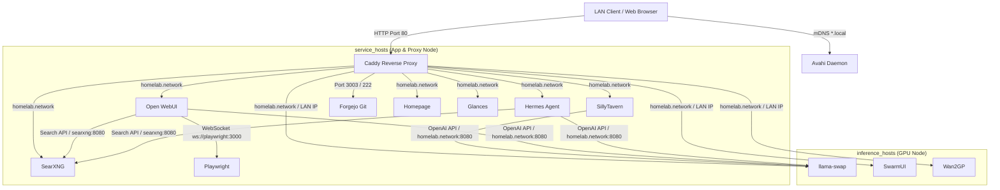

# Architecture & Repository Structure

This document describes the architectural layout, host group design, networking topology, and directory structure of the homelab infrastructure.

---

## Overview

The homelab infrastructure automates self-hosted services using **Ansible** for centralized configuration and **Podman Quadlets** integrated into `systemd` for container management.

Key principles:
- **Rootless Containers**: All application containers run under rootless Podman environments with systemd user linger enabled.
- **Declarative Unit Files**: Services are defined as `.container` Quadlet templates deployed into `~/.config/containers/systemd/`.
- **mDNS Alias Resolution**: LAN clients access services using zero-configuration mDNS hostnames (`*.local`) published via Avahi.
- **Centralized Reverse Proxy**: Caddy listens on unprivileged host port `80` to proxy incoming HTTP requests based on the `Host` header to upstream container ports.

---

## Architecture & Host Groups

The inventory organizes machines into functional host groups:



### Host Group Descriptions

- **`inference_hosts`**:
  - Hosts equipped with GPUs for artificial intelligence and machine learning workloads.
  - Deploys NVIDIA Container Toolkit (CDI generation) and Quadlet services such as `llama-swap`, `SwarmUI`, and `Wan2GP`.
  - `llama-swap` serves as the single, unified multi-model proxy and VRAM lifecycle manager for all LLM inference traffic.
- **`service_hosts`**:
  - Hosts running application containers, proxy services, and local network utilities.
  - Deploys `caddy`, `sillytavern`, `open-webui`, `hermes-agent`, `searxng`, `playwright`, `piclaw`, `forgejo`, `homepage`, `glances`, and `avahi`.
  - Frontend AI applications (`sillytavern`, `open-webui`, `hermes-agent`) route model completion calls internally to `llama-swap:8080`.
  - `searxng` acts as the self-hosted search aggregator for Open WebUI and Hermes Agent web search operations over `homelab.network:8080`.
  - `playwright` handles browser rendering and content extraction for Open WebUI over `ws://playwright:3000`.
  - `glances` monitors the host (CPU, memory, temp, uptime, disk) and exposes a REST API that Homepage's Glances info widget consumes over `homelab.network`.

### Deployment Topologies

- **Single-Machine Deployment (Default)**:
  - Both `inference_hosts` and `service_hosts` target `desktop` via Ansible's `local` connection.
  - Upstream proxy targets default to container names on the internal bridge network (`homelab.network`).
- **Multi-Machine Expansion**:
  - Inference workloads and general application services can be split across separate physical machines simply by defining new host targets under `service_hosts` or `inference_hosts` in `inventory/hosts.yml`.
  - Caddy upstreams can be overridden in `inventory/group_vars/service_hosts.yml` to target cross-host IP addresses.

---

## Network & Traffic Flow

1. **Host Name Resolution**:
   - `avahi-aliases` publishes mDNS records for hostnames specified in `avahi_aliases` (e.g. `sillytavern.local`, `forgejo.local`, `llamaswap.local`).
   - Clients resolve `*.local` directly to the host IP.
2. **Port 80 Routing**:
   - System parameter `net.ipv4.ip_unprivileged_port_start = 80` allows the unprivileged Caddy container to bind directly to host port `80`.
3. **Upstream Forwarding**:
   - Caddy inspects the incoming HTTP `Host` header and forwards traffic to the corresponding container service port.
4. **Unified LLM Inference Routing**:
   - `SillyTavern` connects directly to `http://llama-swap:8080/v1` over `homelab.network`.
   - `Open WebUI` connects to both `http://llama-swap:8080/v1` (for raw model completions) and Hermes Agent's OpenAI-compatible API server at `http://hermes:8642/v1` (for agent-assisted chats) over `homelab.network`.
   - `llama-swap` handles model swapping, VRAM allocation, and TTL-based model auto-unloading dynamically.
5. **Direct Port Exposure**:
   - Every web-accessible service publishes a direct host port (see the README service table) so it can be reached at `http://<host-ip>:<port>` without mDNS or the reverse proxy.
   - Forgejo binds web port `3003` and SSH port `222` directly to the host for non-proxied or SSH access.
   - The Homepage dashboard rewrites service links to the direct `host:port` form when it is accessed via IP instead of mDNS (see `homepage.custom.js`).

> [!NOTE]
> Direct host-port access and the Homepage IP-aware link rewriting assume a **single-host deployment** (both `inference_hosts` and `service_hosts` on the same machine, the default topology). On a split-host topology, the direct port of each service belongs to its own host, so `<host-ip>:<port>` links must be resolved per-host. This is a known limitation to be addressed in a future release.

---

## Homepage Dashboard & Container Label Discovery

[Homepage](https://gethomepage.dev) populates the dashboard dynamically from container labels via the Docker-compatible Podman socket, replacing any manual `services.yaml` definition.

### How discovery works

- The homepage container mounts the rootless Podman socket read-only and points its docker config at it:
  - `Volume=/%t/podman/podman.sock:/var/run/docker.sock:ro` in `homepage.container.j2`
  - `docker.yaml` in the homepage config dir: `my-docker: socket: /var/run/docker.sock`
- **Filename case matters**: Homepage only reads `docker.yaml` (lowercase) — see `checkAndCopyConfig("docker.yaml")` in `src/utils/config/service-helpers.js`. A differently-cased file (e.g. `Docker.yaml`) is silently ignored, which leaves discovery using the shipped skeleton (no instances): no containers are discovered and no container stats populate.
- Homepage **merges** manual `services.yaml` groups with discovered ones (`api-response.js: servicesResponse`), so a stale `services.yaml` from a previous deployment keeps resurrecting old groups. An empty (comment-only) `services.yaml` is deployed on purpose so no manual groups exist.

### Labeling containers

Every web-accessible container carries `homepage.*` labels in its quadlet template:

| Label | Example |
| :--- | :--- |
| `homepage.group` | `Label=homepage.group="Web Services"` |
| `homepage.name` | `Label=homepage.name="Open WebUI"` |
| `homepage.icon` | `Label=homepage.icon=open-webui.png` |
| `homepage.href` | `Label=homepage.href=http://openwebui.local` |
| `homepage.description` | `Label=homepage.description="Chat & RAG frontend"` |

Optional widget labels use dot notation (`homepage.widget.type=...`, `homepage.widget.url=...`, `homepage.widget.fields=...`). Multiple widgets use an index, e.g. `homepage.widgets[0].type=...`.

**Critical quadlet quoting rule**: the Podman Quadlet generator splits `Label=` values on whitespace and strips surrounding quotes when it builds the `podman run` command. Multi-word values (including `&`) MUST be double-quoted, and JSON array values MUST be single-quoted:

- `Label=homepage.group="Web Services"` → podman stores `Web Services` (quotes stripped, space preserved)
- `Label=homepage.widget.fields='["upstreams","requests"]'` → stored as a valid JSON array

Leaving multi-word values unquoted silently produces broken labels (e.g. `homepage.description=Reverse proxy` becomes two `--label` args). Verified with `podman-system-generator` + `podman inspect`.

### Groups & layout

Label groups match the `settings.yaml` layout keys so row layouts apply. Current groups: `Inference`, `Web Services`, `Infrastructure`. Adding a new group requires a matching `layout:` entry in `homepage.settings.yaml.j2`.

### Host resource monitoring

The `glances` container publishes its REST API to the shared network, and the Homepage **Glances** info widget (`homepage.widgets.yaml.j2`) shows real **host** CPU, memory, temperature, uptime, and disk usage. Unlike the built-in `resources` widget (which reads only the Homepage container's own stats via `systeminformation`), the Glances widget reads host statistics from the Glances REST API. Glances runs with `--pid=host`, read-only `/sys`, `/etc/os-release`, and host-root (`/:/host`) mounts; the widget monitors host disk via `disk: /host`. Authentication is enforced with basic auth (`--password`) wired through `vault_glances_username` / `vault_glances_password`. A small `custom.css` rule (see below) makes the Glances widget span the full header row above the search/datetime widgets.

### Config files in the homepage config dir

| File | Purpose |
| :--- | :--- |
| `docker.yaml` | Docker/Podman socket config — the discovery source |
| `settings.yaml` | Theme, layout, `showStats: true` |
| `services.yaml` | Intentionally empty/comment-only (see below) |
| `widgets.yaml` | Info widgets (search, datetime, glances host resource monitor) |
| `bookmarks.yaml` | Bookmark groups |
| `custom.css` | Optional custom CSS served at `/api/config/custom.css`; stretches the glances info widget to full width above the search/datetime row |

`services.yaml` must exist but be empty: Homepage's `checkAndCopyConfig` re-copies its shipped skeleton (the `My First/Second/Third Group` example groups) whenever the file is absent, so an empty placeholder file is deployed to suppress those examples. An empty config parses to `null` and `parseServicesToGroups(null)` returns `[]`.

### Host validation

Homepage's middleware (`src/middleware.js`) exact-matches the full `Host` header against `HOMEPAGE_ALLOWED_HOSTS` plus `localhost:<internal-port>` defaults. Access via the published port (`localhost:3002`) never matches the internal `localhost:3000` default, so the published `host:port` list is templated from `homepage_port` and includes the host's default LAN IPv4 address (from `ansible_default_ipv4.address`) so the dashboard is reachable at `http://<host-ip>:3002` from other devices. Additional hosts/IPs can be appended via `homepage_allowed_hosts_extra`.

### Security note: rootless Podman networks do not isolate

All rootless Podman bridge networks live in a single shared network namespace, and the kernel routes between them via the bridge gateways. Separate Podman networks are separate **L2** domains, **not L3-isolated** — any container can reach any other container's IP across networks. Do not rely on a "private" network to restrict access to an unauthenticated admin/management API. (This is why Caddy's unauthenticated admin endpoint is intentionally NOT exposed for a Homepage widget: it would be reachable by every container, not just Homepage.)

---

## Container Auto-Update & Lifecycle Management

Service containers pulled from remote registries include Quadlet `AutoUpdate={{ <service>_autoupdate | default('registry') }}` directives.

### How Automated Updates Work

1. **Systemd User Timer (`podman-auto-update.timer`)**:
   - Automated updates are managed by the user systemd unit `podman-auto-update.timer`.
   - The default schedule is set to **every Tuesday at 4:00 AM** (`Tue *-*-* 04:00:00`) via a systemd drop-in override (`~/.config/systemd/user/podman-auto-update.timer.d/override.conf`).
   - When triggered, `podman auto-update` checks remote container registries for updated image tags. If a newer image is available, Podman pulls the image and restarts the container service cleanly.
   - **Smart Pre-Check for Locally Built Services (SwarmUI & Wan2GP)**: To prevent expensive 10GB+ RAM/CPU container rebuilds when no code has changed, systemd service drop-in override (`~/.config/systemd/user/podman-auto-update.service.d/override.conf`) runs `~/homelab/bin/homelab-auto-rebuild-check.sh` before `podman auto-update`. The script checks upstream Git commit SHAs via `git ls-remote` in ~0.5 seconds. Rebuilds (`systemctl --user restart <service>-build.service`) are only triggered if new commits exist upstream; otherwise rebuilds are skipped entirely.

2. **Holding Off or Disabling Updates for Specific Services**:
   - **Disable via Inventory Variable**: Set `<service>_autoupdate: "disabled"` in `inventory/group_vars/service_hosts.yml` or `inference_hosts.yml` (e.g. `openwebui_autoupdate: "disabled"`). Re-run the site playbook to update the Quadlet unit definition.
   - **Pin Container Image Version**: Override the service image tag in Quadlet templates or inventory variables (e.g. `codeberg.org/forgejo/forgejo:10.0.0`).

3. **Manual Update Execution**:
   - Check for updates without applying:
     ```bash
     podman auto-update --dry-run
     ```
   - Trigger immediate updates across all tracked services:
     ```bash
     podman auto-update
     ```
   - Manually pull and restart a single service:
     ```bash
     podman pull ghcr.io/open-webui/open-webui:main
     systemctl --user restart open-webui.service
     ```

---

## Repository Structure

```
homelab/
├── .vault-pass                  # Vault password file (user-created, gitignored)
├── ansible.cfg                  # Ansible configuration (inventory path, roles, callbacks)
├── inventory/
│   ├── hosts.yml                # Host inventory and group mappings
│   └── group_vars/
│       ├── all/
│       │   ├── vars.yml         # Shared paths and baseline system configuration
│       │   └── vault.yml        # Encrypted secrets (gitignored)
│       ├── inference_hosts.yml  # GPU layers, context sizes, and model paths
│       └── service_hosts.yml    # Service ports, upstream addresses, and mDNS aliases
├── playbooks/
│   └── site.yml                 # Main site orchestration playbook
├── roles/
│   ├── base/                    # Core setup: directories, sysctl port 80, user lingering, Quadlet network/volume
│   ├── nvidia/                  # NVIDIA container toolkit repo setup & CDI spec generation
│   ├── quadlets/                # Jinja2 container templates & systemd user service lifecycle management
│   ├── avahi/                   # Avahi package, systemd template unit, & mDNS alias publishing
│   └── caddy/                   # Caddyfile deployment & container reload
├── docs/
│   ├── architecture.md          # Architecture and repository structure guide (this file)
│   └── configuration.md         # Configuration reference & group variable specifications
├── CONTRIBUTING.md              # Contributor guidelines, coding conventions, & agent rules
├── LICENSE                      # MIT license file
└── README.md                    # Project overview & Quick Start guide
```
